# Система круиз-контроля для автомобилей, не оснащенных этой функцией штатно.


## 1. О проекте

Этот проект позволяет добавить систему круиз-контроля в автомобили, где такая функция не предусмотрена производителем, а педаль газа — электронная, реостатного типа.

Система основана на микроконтроллере ATMega328 (Arduino), использует ШИМ выводы для симуляции положения педали газа и плату mcp2515 в качестве CAN-интерфейса для получения информации о скорости.


## 2. Особенности

- **Полноценный круиз-контроль** с обратной связью по скорости через CAN-шину
- **Не теряется контроль над автомобилем** при отказе элементов системы
- **Легко подключается** к любому автомобилю с электронной педалью газа реостатного типа
- **Не разрывается ни одна цепь** заводской проводки при установке
- **Не требуется прошивка ЭБУ** автомобиля
- **Простая калибровка** под разные автомобили
- **Легко доработать исходный код** и расширить возможности системы


## 3. Требования к автомобилю

1. Электронная педаль газа реостатного типа
2. Наличие OBD2 разъема (признак наличия в автомобиле CAN-шины)


## 4. Установка и настройка

В этом разделе кратко описывается устройство системы. В следующих — подробно разбирается каждая составляющая, требующая внимания.

### 4.1. Перечень необходимых компонентов
- Arduino Nano
- Плата MCP2515
- Кнопка
- Светодиод
- Резисторы
- Конденсаторы
- Провода
- Макетная плата
- Преобразователь питания 14V..5V.

### 4.2. Схема системы
Предполагается, что все элементы схемы вам знакомы.
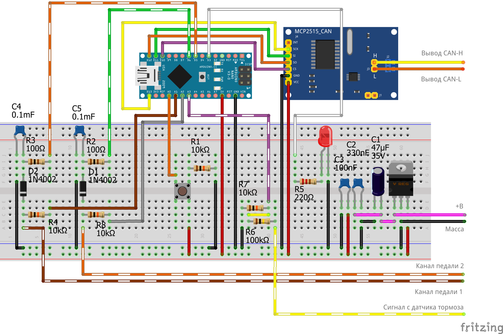\
    _Рис. 1. Схема на макетной плате._

### 4.3. Исходный код прошивки Arduino

Нужно взять [отсюда](src/default_sketch.ino).
Библиотеку для mcp2515 рекомендую [вот эту](https://github.com/autowp/arduino-mcp2515).

### 4.4. Подключение к автомобилю

Перед подключением каждого контакта проверьте точку, к которой подключаетесь, вольтметром. Черный провод вольтметра при этом следует всегда соединять с массой ("-", кузов и т. д.).

- Выводы каналов имитации педали газа подсоединить напрямую к сигнальным проводам (выводы 4, 6 на рисунке 2). Напряжение на каждом из этих выводов при включенном зажигании должно быть не нулевое, а при нажатии на педаль — меняться. Напрмер, на выводе 4 будет напряжение ``0.35..2.15В``, а на выводе 6 — ``0.77..4.3В``, или наоборот.

    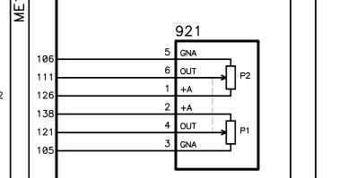\
    _Рис. 2. Пример схемы включения педали газа._
- Выводы датчика педали тормоза подсоединить к проводу, идущему на стоп-сигнал (вывод AP01 на рисунке 3). Напряжение на этом выводе должно быть `0В` при отпущенной педали тормоза и порядка `12В` при нажатой.

    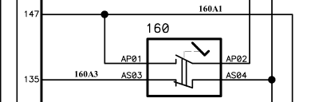\
    _Рис. 3. Пример схемы включения датчика педали тормоза._

- Питание и соединение с CAN-шиной автомобиля целесообразно осуществить через OBD2 раъем, см. рисунок 4.
    - 4 пин — ``масса ("-")``
    - 16 пин — ``+B``
    - 6 пин — ``CAN-High``
    - 14 пин — ``CAN-Low``

    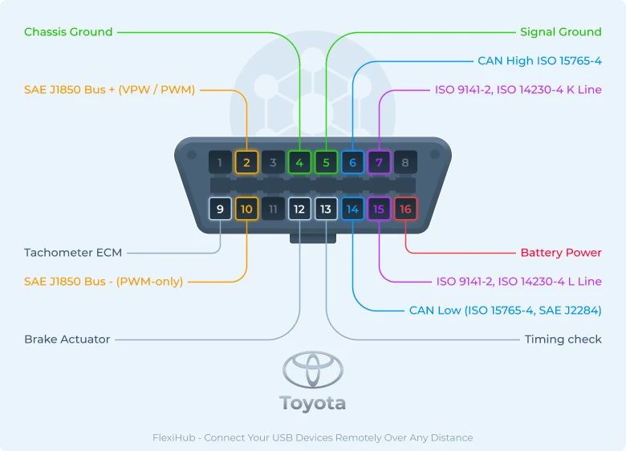
    _Рис. 4. Распиновка OBD2 разъема._

### 4.5. Калибровка

При первом запуске нужно провести **калибровку** педали, чтобы система знала диапазоны каналов педали газа. Для этого, после установки системы на автомобиль, убедясь, что питание на микроконтроллер подается, включите зажигание и нажмите полностью на педаль газа. Теперь система знает минимальные и максимальные значения напряжения на сигнальных выводах педали газа. **Для повторной калибровки** необходимо в течении трех секунд удерживать кнопку включения круиз-контроля.

### 4.6. Использование

#### Включение
При достижении желаемой скорости нажмите кнопку включения круиз-контроля. Загорится светодиод, означающий корректное считывание текущей скорости и включение системы автоматического регулирования.

#### Выключение
Для выключения системы круиз-контроля нажмите на педаль тормоза. Достаточно прожать её до момента, когда загорятся стоп-сигналы и система сразу отключится, светодиод погаснет.


## 5. Детали релизации

### Электронная педаль газа реостатного типа
С тех пор, как усугубились душные движения на тему удушающих газов, возникла необходимость ещё оптимальнее с точки зрения вредных выбросов управлять работой ДВС. Давно известно, что, если что-то работает достаточно детерминированно, нужно отдать это автоматике. Так и поступили с приводом дроссельной заслонки, заменив тросик на датчик положения педали газа (ДППГ или электронная педаль газа) и на дроссельный узел с сервоприводом дроссельной заслонки. Теперь у ЭБУ есть возможность работать дроссельной заслонкой более плавно и лучше согласовывать количество поступающего воздуха с колическом поступающего бензина.

На данный момент существуют датчики положения педали газа разного типа: основанные на эффекте Холла, реостатные. В этом проекте симулируется именно педаль газа реостатного типа.

Что такое __реостат__? — Это такой резистор, который может менять сопротивление при перемещении по нему движка.

Фактически, для увеличения надежности системы, в датчике положения педали газа есть два реостата, сигналы которых согласованы.

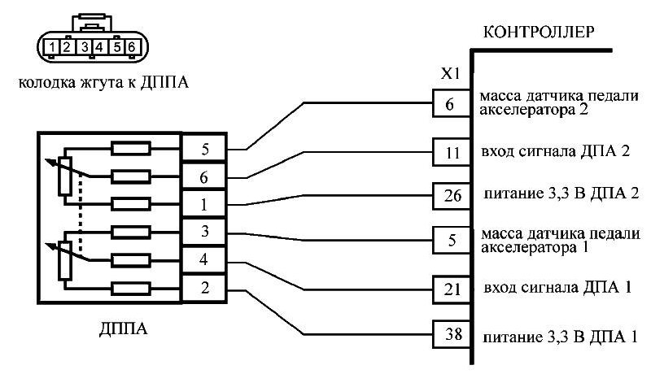\
_Рис. 5. Типичная схема такой педали._

Данная схема является частным примером, показывающим общий принцип. На рисунке 5 видно две группы контактов, относящиеся к двум каналам ДППГ (561 и 342). Как видно, сопротивление между контактами 1 и 5, 2 и 3 всегда одинаково, а вот сопротивление между контактами 1 и 6, 2 и 4 (следовательно, 6 и 5, 4 и 3) изменяется в зависимости от положения педали. Таким образом, каждый канал ДППГ является делителем напряжения.

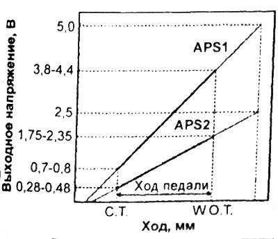\
_Рис. 6. Типичный выход такой педали._
> На рисунке 6 сигналы ASP1 и ASP2 являются напряжениями относительно массы на контактах 4 и 6 рисунка 5.

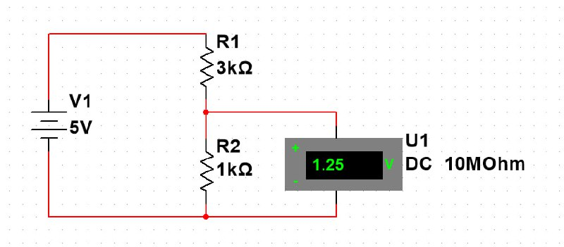\
_Рис. 7. Делитель напряжения._

Уравнение, описывающее поведение делителя напряжения:

$$
U_{R_{2}}=I\cdot R_{2}=\frac{U}{R_{1}+R_{2}}\cdot R_{2}=\frac{5\cdot 1000}{3000+1000} = \frac{4}{5}=1.25 В
$$

Для симуляции сигнала на выводах 6 и 4 (если смотреть по рисунку 5), необходимо обеспечить на них наличие напряжения.

Этого можно достичь двумя способами:
1. Разорвать цепь сигнала от ДППГ к ЭБУ и подать напрямую на вывод ЭБУ необходимое напряжение.\
    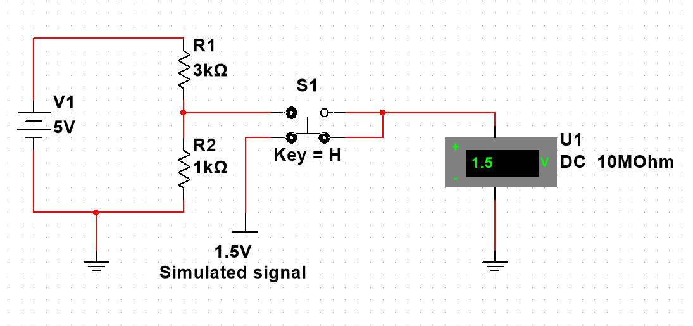\
    _Рис. 8. Схема симуляции положения педали с разрывом._

    В таком случае, необходимо обеспечить наличие переключающего устройства, типа реле или транзисторных мостов, чтобы по команде переключать источники сигналов для ЭБУ. Этот вариант рабочий, но при включенной цепи симуляции сигнала с педали ЭБУ никак не будет реагировать на фактическое изменение положение педали газа. То есть, при возникновении необходимости резко ускориться, водитель нажмет на педаль газа и ничего не произойдет. Это минус. Существует плюс — можно значительно увеличивать сопротивление в RC-цепи для увеличения постоянной времени.
2. Не разрывая цепь сигнала от ДППГ к ЭБУ, подать на сигнальный вывод напряжение.\
    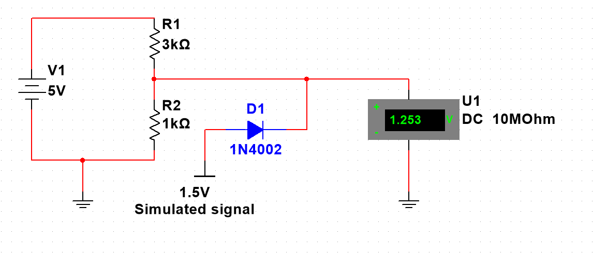\
    _Рис. 9. Схема симуляции положения педали без разрыва._

    При таком включении оригинальная цепь не разрывается и, в случае необходимости резкого ускорения, сигнал с реальной педали газа корректно передастся на ЭБУ. Для предотвращения возникновения обратных токов, когда напряжение на выводе сглаживающего устройства мало, устанавливается диод. Этот вариант является предпочтительным и будет рассматриваться далее.

Теперь возникает ограничение в выборе сопротивления для RC-цепи, поскольку образовался второй делитель. Так как далее будут приведены формулы и результаты моделирования, тут лишь качественно укажу, что, например, если сопротивление RC-цепи выбрать равным $R = 1 кОм$ и сопротивление перехода 6-5 будет $R_н=1 кОм$, то при подаче напряжения $U_{вх} = 5 В$ с вывода 6 получится снять только `2.5В`.
> Обозначения взяты из раздела "Симуляция нажатия на педаль газа"

Поэтому лучше проверить сопротивления переходов 6-5 и 4-3, хоть на большинстве ДППГ оно порядка 1кОм при отпущенной педали и порядка 3кОм при полностью нажатой. Именно его нужно рассматривать как сопротивление нагрузки при рассчете RC-цепи ЦАП.

### Обеспечение питания
Так как прибор будет работать на автомобиле, абсолютно целесообразно запитывать его от бортовой сети автомобиля. Напряжение бортовой сети автомобиля может меняться от 11.6 до 14.2 и более вольт. Теоретически, в случае неисправности регулятора напряжения (он располагается в щеточном узле генератора), напряжение может подниматья еще выше. Сюда же накладываются скачки напряжения при включении/выключении мощных потребителей. В общем, нужен стабилизатор питания.

На плате Arduino Nano уже есть стабилизатор питания AMS1117, с входом которого соединен пин `Vin` Arduino. Номинальный предел напряжения на этот пин — 12В. Документация же на AMS1117 говорит о предельном напряжении в 15В.\
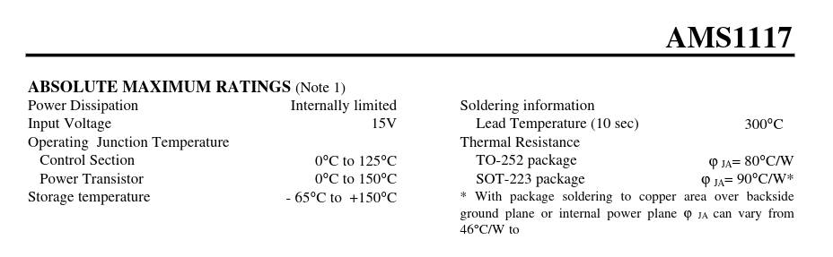\
_Рис. 10. Максимальные значения AMS1117._
> В некоторых датащитах находятся другие значения.

В принципе, 15 > 14.2, но запас небольшой. Если не хотите заморачиваться для ещё большей надежности, то подавайте через выключатель плюс бортовой сети на вывод `Vin` Arduino Nano. В таком случае, следует установить электролитический конденсатор емкостью порядка 47 мкФ между выводами `Vin` и `GND`.

Я же предлагаю использовать дополнительный стабилизатор __LM7805__.
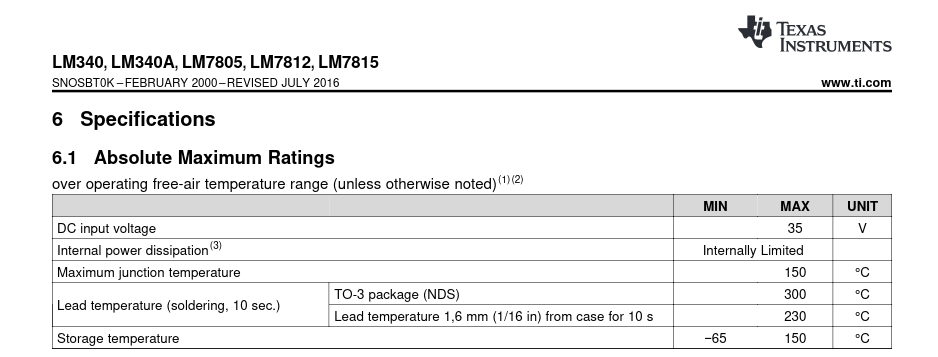\
_Рис. 11. Максимальные значения LM7805._

Как видно из датащита, максимальное входное напряжение этого стабилизатора уже 35В, что увеличивает надежность прибора.
> Естественно, по желанию, можно использовать и импульсные преобразователи.

Итак, с учетом рекомендуемой схемы включения LM7805 цепь питания выглядит следующим образом:\
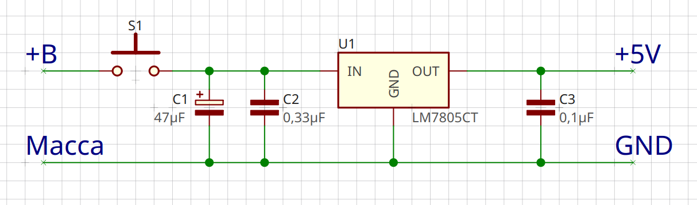\
_Рис. 12. Цепь обеспечения питанием._
> Выключатель S1 лучше предусмотреть для оперативного обесточивания системы. 

### Симуляция нажатия на педаль газа (ЦАП)
Как было показано выше, ЭБУ автомобиля считывает напряжение с вывода электронной педали газа и на основании этого устанавливает дроссельную заслонку в необходимое положение. Следует отметить, что этот сигнал является аналаговым, так как во времени меняется непрерывно и плавно.

ATMega328 может генерировать ШИМ-сигнал, но не имеет встроенного полноценного Цифро-Аналогового Преобразователя (ЦАП). Строго говоря, может ЭБУ и сможет корректно обрабатывать ШИМ-сигнал, но я не проверял этот вариант. В любом случае, предоставление ожидаемого сигнала куда надежнее. Таким образом, необходимо преобразовать ШИМ-сигнал в аналоговый. 

Для сглаживания сигналов используют RC-цепи. В принципе, можно было бы опустить этот раздел, сказав лишь, что постоянная времени RC-цепи должна быть больше периода ШИМ, но понятнее будет привести симуляцию. _Период можно рассчитать из частоты, которая, кстати, у цифровых выводов 5 и 6 равна 976 Гц._

Итак, рассмотрим RC-цепь с нагрузкой.

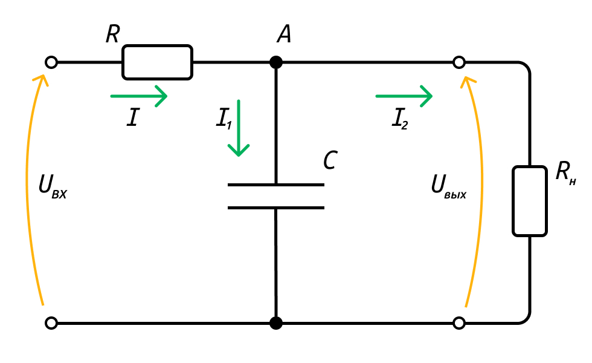\
_Рис. 13. RC-цепь._

Напомню, что скорость изменения заряда есть ток:

$$
I=\frac{dq}{dt}\Rightarrow q=\int Idt
$$

Теперь составим систему уравнений, описыващих эту схему. Первые два уравнения — __2-й закон Кирхгофа__, третье — __1-й закон Кирхгофа__:

>Примечание: второй закон Кирхгофа звучит как "сумма ЭДС в контуре равна сумме падений напряжений на всех участках этого контура", а ЭДС обычно обозначается $E$. В рассматриваемой схеме я назвал эту ЭДС $U_{вх}$, так как внутреннее сопротивление источника пренебрежимо мало по сравнению с сопротивлениями в цепи и напряжение входа можно рассматривать только как ЭДС. Пусть эта замена обозначения вас не беспокоит.

$$
\begin{cases}
U_{вх}=U_R+U_C=I\cdot R+\frac{q}{C}=I\cdot R+\frac{1}{C}\int I_1dt \\
0 = I_2\cdot R_н-\frac{1}{C}\int I_1dt \\
I = I_1 + I_2
\end{cases}
$$

Преобразуем первые два уравнения системы:

$$
\begin{cases}
I = \frac{U_{вх}}{R}-\frac{1}{C\cdot R}\int I_1dt \\
I_2=\frac{1}{C\cdot R_н}\int I_1dt
\end{cases}
$$

Тогда из третьего уравнения:

$$
I_1 = I-I_2 = \frac{U_{вх}}{R}-\Bigl( \frac{1}{C\cdot R}+\frac{1}{C\cdot R_н}\Bigl)\int I_1dt
$$

Заменим ток на заряд и получим дифференциальное уравнение схемы:

$$
\dot q=\frac{U_{вх}}{R} - \Bigl(\frac{1}{C\cdot R} + \frac{1}{C\cdot R_н}\Bigl)\cdot q
$$

Напряжение на конденсаторе (искомое выходное) будет равно:

$$
U_{вых} = U_C=\frac{q}{C}
$$

Решим это уравнение в MATLAB Simulink:
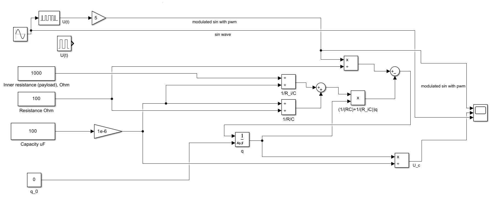\
_Рис. 14. Модель процесса._

Перебирая разные значения сопротивления и емкости, можно добиться разного поведения схемы. Оптимальными мне показались значения, которые находятся на рисунке. _Роль сопротивления нагрузки играет сопротивление между сигнальным выводом каждого канала и массой._

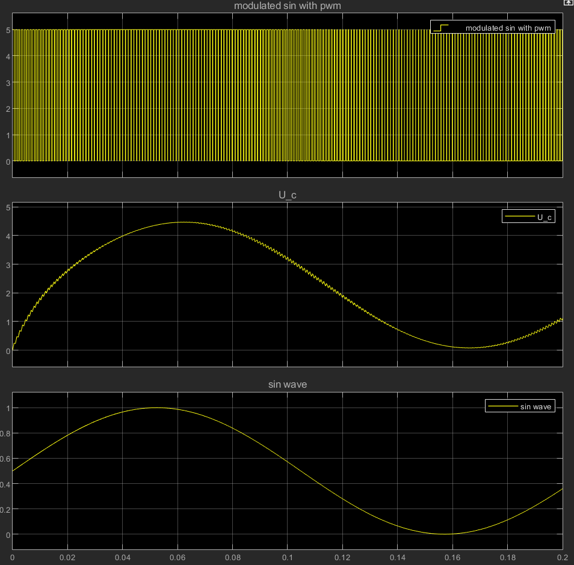\
_Рис. 15. Результат моделирования процесса._

На графике сверху представлен sin-сигнал со смещением 2.5 и амплитудой 2.5, модулированный ШИМ. Этот сигнал подается в качетсве напряжения входа. 

На среднем графике находится напряжение на конденсаторе с заметной пилообразностью, отражающей суть работы конденсатора (заряжаться, когда есть напряжение и разряжаться, когда входное напряжение равно нулю). Также, на этом графике виден результат наличия делителя напряжения ($R$, $R_н$). Когда заполнение ШИМ-сигнала достигает 100%, на выводе модулированного сигнала $U_{вх}$ напряжение становится равным 5В, но, несмотря на это, демодулированный сигнал $U_c$ не равен 5В.

Таким образом, необходимые сопротивление резистора и емкость конденсатора определены. __R = 100 Ом, C = 100 мкФ__.

### Обратная связь по напряжению на выводе педали газа
На общей схеме присутствуют также два канала обратной связи по напряжению. Каждый канал имеет резистор и подключается к аналоговому входу микроконтроллера.
> Резистор в обратной связи нужен для предотвращения короткого замыкания в случае выхода из строя микроконтроллера. Без него, при закорачивании аналогового выхода на массу, выходной сигнал педали газа всегда будет 0, а для исправления этой проблемы потребуется разорвать цепь обратной связи.

Назначение обратной связи состоит в следующем:
1. Калибровка под конкретную педаль
2. Пддержание нужного напряжение на выводе

Дело в том, что если постоянная времени RC-цепи будет меньше периода ШИМ, то это наложит некоторые искажения на выходной сигнал. Примеры этих искажений приведены на рисунках 17, 19. На каждой паре изображений все параметры элементов цепи одинаковы за исключением емкости конденсатора. Как видно, в случае корректного подбора емкости и сопротивления напряжение на выходе (U1) не совпадает со случаем, когда емкость занижена.
> Цепь 5V в правой части схемы имитирует канал педали газа в каком-либо положении. Как уже было сказано ранее — каждый канал является выходом делителя напряжения.

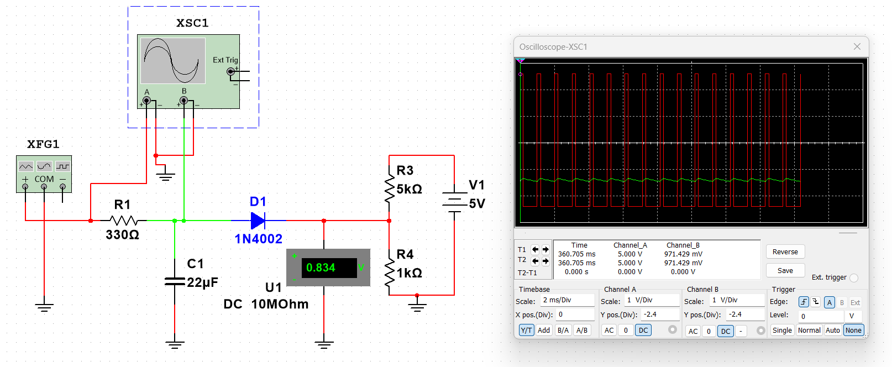\
_Рис. 16. Пример корректной работы, низкий сигнал._

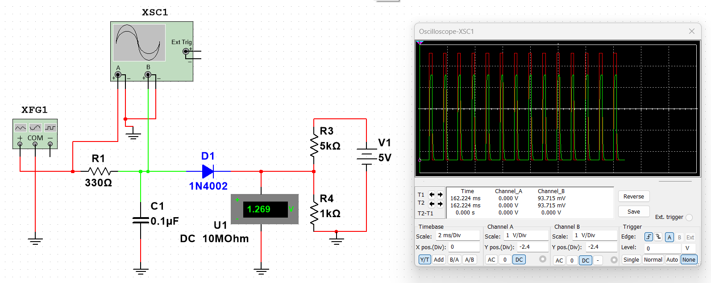\
_Рис. 17. Пример некорректной работы, низкий сигнал._

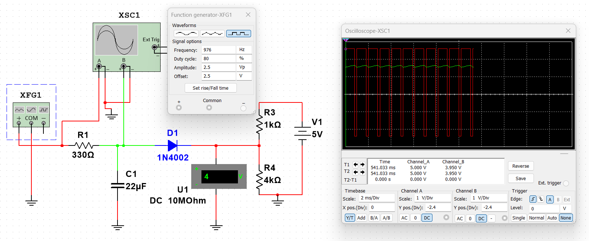\
_Рис. 18. Пример корректной работы, высокий сигнал._

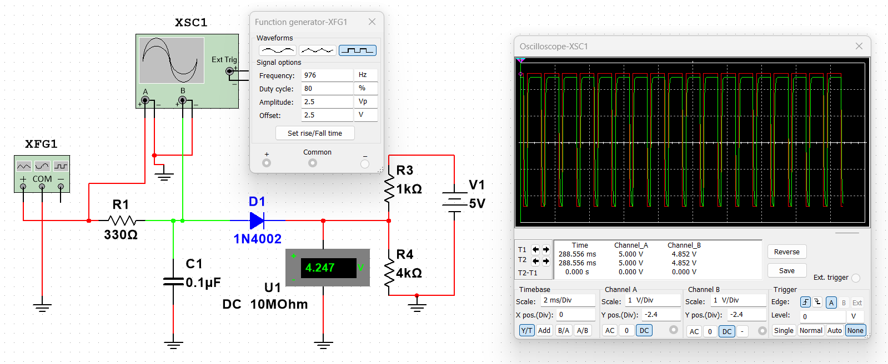\
_Рис. 19. Пример некорректной работы, высокий сигнал._

Теперь у ПО микроконтроллера есть возможность отследить превышение напряжения и прекратить увеличение значения ШИМ-сигнала или вовсе организовать ещё одну петлю управления, в которой будет удерживаться нужное напряжение на конкретном канале независимо от фактического положения педали газа (система сможет лишь повышать это напряжение, но всё же).

### Чтение сигнала с датчика положения педали тормоза
Так как сигнал следует считывать после концевика педали тормоза, то при нажатой педали тормоза на проводе оказывается напряжение бортовой сети. Это напряжение велико для микроконтроллера, так что необходимо организовать делитель напряжения, как показано на рисунке.\
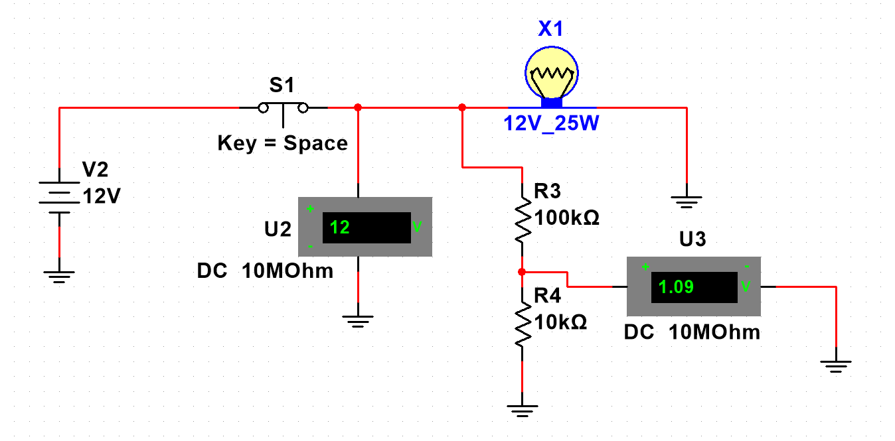\
_Рис. 20. Схема чтения сигнала с концевика педали тормоза._
> Роль концевика на схеме выполняет выключатель S1. Когда педаль нажата — он замкнут.

Нюанс использования такой схемы состоит в том, что если выходное напряжение делителя будет меньше 2.5В (а лучше взять с запасом — 3В), необходимо подключать этот вывод к аналоговому входу микроконтроллера и отслеживать уже превышение некоторого порогового сигнала, например:

```c
if(analogRead(A0) > 127){ // U > 0.625 В
  // Обработка нажатия на педаль тормоза
}
```

### Калибровка под конкретную педаль
Для того, чтобы произвести калибровку под конкретную педаль газа, принимая закон изменения напряжения линейным, необходимо узнать минимальное и максимальное напряжения на каждом канале педали газа. После осуществления калибровки, следует записать эти данные в ПЗУ микроконтроллера.

```c
#include <EEPROM.h>

#define CHANNEL_1_PIN A1
#define CALIBRATION_TIME_MS 3000
#define STATE_IDLE 0
#define STATE_CALIBRATION 1

struct Data {
    uint8_t ch1Min;
    uint8_t ch1Max;
};

Data data;
uint8_t state = STATE_IDLE; // default
unsigned long calibrationStartTime = 0;

uint8_t tmpLow;
uint8_t tmpHigh;

void setup() {
    // прочитать из адреса 0 в data
    EEPROM.get(0, data);

    if(data.ch1Max == 0 || data.ch1Min == 0){
      startCalibration();
    }
}

void loop() {
  switch(state){
    case STATE_IDLE: idleLoop(); break;
    case STATE_CALIBRATION: calibrationLoop(); break;
  }
}

void startCalibration(){
  state = STATE_CALIBRATION;
  calibrationStartTime = millis();
  tmpLow = 255;
  tmpHigh = 0;
}

void idleLoop(){
  // Здесь уже в data.ch1Min и data.ch1Max будут корректные значения
}

void calibrationLoop(){
  uint8_t ch1Value = analogRead(CHANNEL_1_PIN)/4;
  if(ch1Value > tmpHigh){
    tmpHigh = ch1Value;
  }
  if(ch1Value < tmpLow){
    tmpLow = ch1Value;
  }
  if(millis() - calibrationStartTime > CALIBRATION_TIME_MS){
    // Время калибровки прошло, записываем значения
    data.ch1Max = tmpHigh;
    data.ch1Min = tmpLow;

    EEPROM.put(0, data);

    state = STATE_IDLE;
  }
}
```
> В течение калибровки необходимо полностью нажать на педаль газа и отпустить её.

Также разумно будет дать возможность перенастроить эти значения. Например, при удержании кнопки включения круиз-контроля в течении 3-х секунд.

```c
...

#define BUTTON_PIN A0
#define BUTTON_HOLD_TIME_MS 3000

...

bool buttonPressed;
unsigned long buttonPressedTime;

...

void idleLoop(){
  if(analogRead(BUTTON_PIN) > 512){
    if(!buttonPressed){
      buttonPressed = true;
      buttonPressedTime = millis();
    }
    if(millis() - buttonPressedTime > BUTTON_HOLD_TIME_MS){
      // В цикл калибровки
      startCalibration();
      return;
    }
  } else {
    buttonPressed = false;
  }

  ...
}
```

### Обратная связь по скорости движения
Естественно, для организации круиз-контроля, то есть системы автоматического поддержания скорости, необходимо откуда-то брать информацию о скорости. Можно рассмотреть к качестве источника этой информации непосредственно датчик вращения вала в КПП или датчик вращения колеса системы ABS. Но наиболее универсальным вариантом мне представляется получение информации о скорости от ЭБУ через CAN-шину.Тем более, что коды параметров OBD2 стандартизированы и поддерживаются большим количеством автопроизводителей.

Для того, чтобы взаимодействовать с CAN-шиной, нужен, разумеется, CAN-интерфейс. Им является плата с чипом mcp2515, предоставляющая выводы для CAN-шины и SPI для связи с микроконтроллером.

Библиотеку для ардуино я бы предложил [вот эту](https://github.com/autowp/arduino-mcp2515).

Код для чтения скорости выглядит следующим образом:
```c
#include <SPI.h>
#include <mcp2515.h>

MCP2515 mcp2515(10); // Slave pin
struct can_frame canMsg;


unsigned long previousMillis = 0;
const long interval = 200; // Интервал опроса (мс)

void setup() {
  Serial.begin(115200);
  if(mcp2515.reset() != MCP2515::ERROR_OK){
    Serial.println("Error reset");
    while(1);
  }
  
  if(mcp2515.setBitrate(CAN_500KBPS, MCP_8MHZ) != MCP2515::ERROR_OK){
    Serial.println("Error bitrate");
    while(1);
  }

  if(mcp2515.setNormalMode() != MCP2515::ERROR_OK){
    Serial.println("Error mode");
    while(1);
  }
  Serial.println("Ready");
}

void loop() {
  unsigned long currentMillis = millis();
  
  if (currentMillis - previousMillis >= interval) {
    previousMillis = currentMillis;

    struct can_frame request;
    request.can_id = 0x7DF; // Бродкастный адрес
    request.can_dlc = 8;
    request.data[0] = 0x02; // Длина данных
    request.data[1] = 0x01; // Режим 01
    request.data[2] = 0x0D; // PID Скорости 
    mcp2515.sendMessage(&request);
    
    // Чтение всех доступных CAN-сообщений
    while (mcp2515.readMessage(&canMsg) == MCP2515::ERROR_OK) {
      if(canMsg.can_id == 0x7E8){ // Ответ на запрос
        processSpeed(canMsg);
      }
    }
  }
}

void processSpeed(can_frame &msg) {
  byte speed = msg.data[3]; // На скорость всего 1 байт
  Serial.print("Speed: "); Serial.print(speed); Serial.println(" km/h");
}
```
Более подробную информацию можно найти в репозитории библиотеки.

Важный аспект, который нужно было заметить — скорость возвращается в переменной целочисленного типа с максимальным значением 255. Владельцы быстрых автомобилей, проверьте пожалуйста, что будет при превышении этой скорости :-).\
То, что тип переменной — целочисленный, сразу дает понять порядок точности системы, так как малые отклонения скорости (менее 1 км/ч) система попросту не будет регистрировать. Кроме этого, нужно понимать, что непрерывно данные о скорости поступать не будут. Чтобы зря не засорять CAN-шину пакетами, целесообразно запрашивать данные о скорости раз в промежуток времени. Не менее важным является тот факт, что скорость удастся считывать всегда с какой-то задержкой. Слишком агрессивное регулирование в таком случае приведет к автоколебаниям на ровном месте.
 
Эти факторы нужно учитывать при проектировании системы управления, что и будет сделано далее.

Итак, было показано, как имитировать положение педали газа и как получать информацию о текущей скорости. Теперь нужно связать датчик с исполнительным устройством при помощи регулятора.

### ПИ-контроллер

В качестве регулятора сразу будем использовать традиционный ПИД-контроллер. Я мог бы ограничиться классическим: __"теперь осталось всего лишь подобрать коэффициенты"__, но приятнее их подбирать на модели, а не на изделии, поэтому перейдем к моделированию.


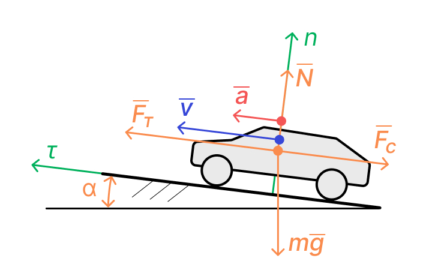\
_Рис. 21. Расчетная схема процесса на плоскости._

Запишем дифференциальное уравнение движения автомобиля в естественных координатах, принебрегая трением:

$$
\begin{cases}
\tau: ma=F_т-F_с-m\cdot g\cdot sin\alpha \\
n: m\frac{v^2}{R}=N-m\cdot g\cdot cos\alpha
\end{cases}
$$

Так как мгновенный радиус траектории ("выпуклость" дороги) достаточно велик, принебрежем проекцией на нормальную ось и сосредоточимся на проекции на касательную ось.

Тут $F_т$ — сила тяги. Она возникает из-за момента двигателя, переданного на колеса, и приближенно равна:

$$
F_т=\frac{C_{др}\cdot M_{дв_{макс}}\cdot i_{КПП}\cdot i_{ГП}}{r_{колеса}}=C_{др}\cdot K_т
$$

>Где:\
>$C_{др}$ — степень открытия дроссельной заслонки (0..1)\
>$M_{дв_{макс}}$ — максимальный крутящий момент двигателя (можно взять из паспортных данных)\
>$i_{КПП}$ — передаточное число КПП (считаем, что автомобиль движется на максимальной передаче, передаточное число можно взять из паспортных данных)\
>$i_{ГП}$ — передаточное число главной пары (можно взять из паспортных данных)\
>$r_{колеса}$ — половина диаметра шины

$F_с$ — сила сопротивления воздуха в штиль. Рассчитывается по формуле:

$$
F_c=0.5\cdot c_x \cdot S \cdot \rho_в \cdot v^2 = K_c\cdot v^2
$$

> Где:\
> $c_x$ — коэффициент обтекаемости, можно усреднённо принять `0.4`\
> $S$ — площадь лобового сечения, $S = w\cdot h$ — габаритную ширину умножить на высоту\
> $\rho_в$ — плотность воздуха, можно принять `1.2`\
> $v$ — линейная скорость автомобиля

Как показано, большое количество членов этих уравнений можно объединить в одну константу.

Перепишем уравнение на касательную ось:

$$
m\dot v=C_{др}\cdot K_т-K_c\cdot v^2 - m\cdot g \cdot sin\alpha
$$

Преобразуем:

$$
\dot v=\frac{C_{др}\cdot K_т}{m} - \frac{K_c\cdot v^2}{m}-g\cdot sin\alpha
$$

Итоговое уравнение и является искомым. Теперь необходимо смоделировать его и добавить регулятор положения дроссельной заслонки с учетом ограничений, изложенных в пунктах выше.

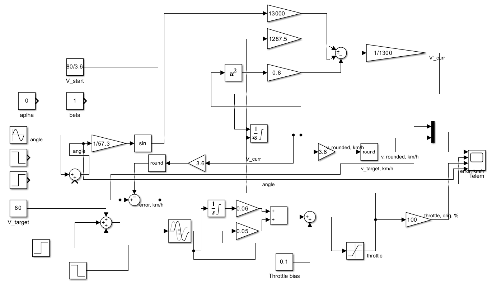\
_Рис. 22. Схема процесса управления в MATLAB Simulink._
> В модели учтены: дискретность получения информации о скорости, задержка данных о скорости и интервалы между запросами данных о скорости.

__Немного про коэффициенты ПИД-контроллера__\
__Во-первых__, считаю разумным сразу отказаться от дифференциальной составляющей, так как её полезно учитывать в процессах с большей разрешающей способностью и большей частотой дискретизации. На отклонение в 1 км/ч способна отреагировать и пропорциональная часть со схожей эффективностью.

__Во-вторых__, предполагая, что регулятор должен управлять комфортно, и понимая, что минимальная ошибка будет равна единице, пропорциональный коэффициент следует выбрать таким образом, чтобы при этом самом минимальном отклонении регулятор не нажимал "в пол". Я решил выбрать 0.05, но это, конечно, не приговор.

__В-третьих__, интегральный коэффициент нужно подбирать с учетом второго пункта, так как интервал времени между получениями данных о скорости примерно равен 200-400 мс, следовательно, интеграл не будет непрерывен во времени. Проще говоря, нужно обеспечить, чтобы сумма пропорциональной и интегральной частей в момент обнаружения системой отклонения в 1 км/ч не сильно "утапливала" педаль газа для обеспечения комфортного управления. 

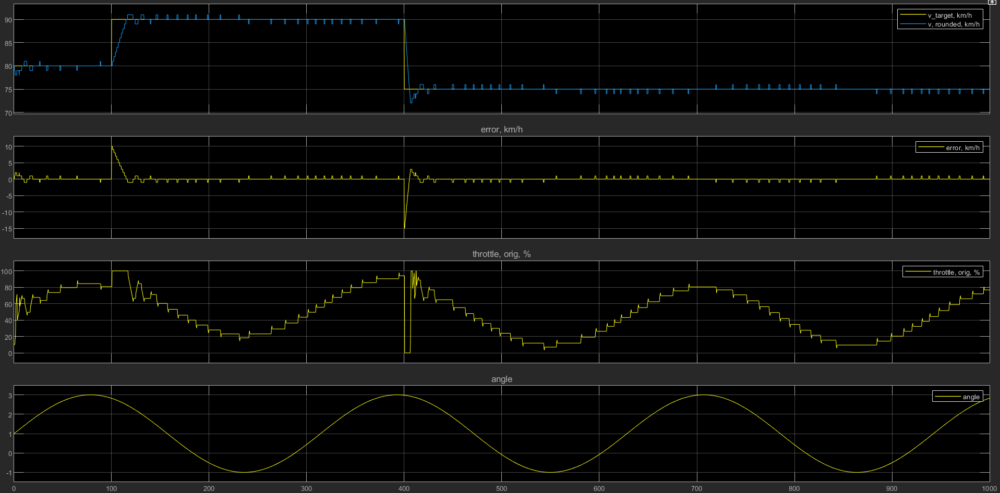\
_Рис. 23. Результат управления в нормальных условиях, волнистость местности небольшая._

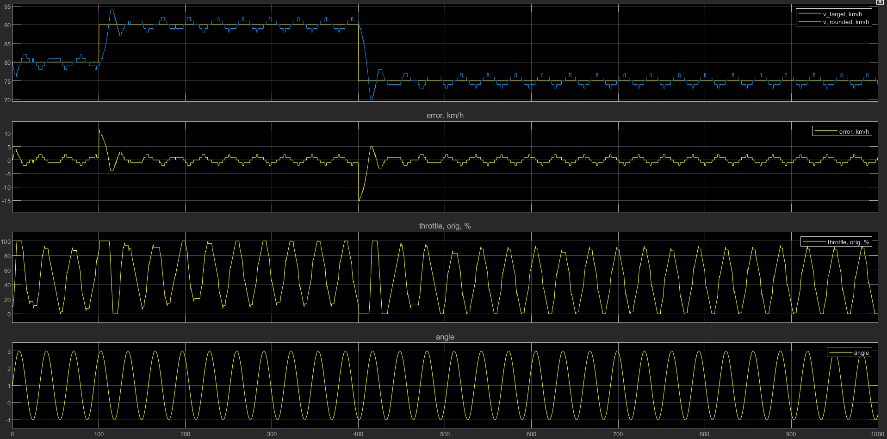\
_Рис. 24. Результат управления в условиях достаточно волнистой местности (период порядка 30 сек.)._

Таким образом, считаю, что оптимальными значениями ПИ-регулятора являются:
- __Kp__ — 0.05
- __Ki__ — 0.06.

## 6. Лицензия 

GPLv3 License. Подробнее в файле [LICENSE](LICENSE).